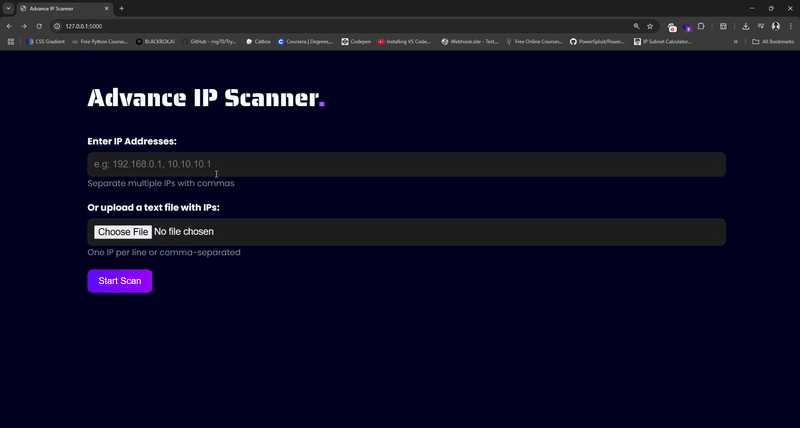

# 🔍 Advanced IP Information Scanner Tool

This is a web-based IP information tool built with **Python Flask**, developed during the **Gurugram Police Cyber Security Summer Internship Program 2025**. It helps analyze multiple IP addresses quickly and generates a PDF report. This project is designed to support cybercrime investigation tasks in real-world scenarios.



## ✅ Key Features

- **Bulk IP Lookup** – Scan multiple IPs via direct input or file upload.
- **Fast & Efficient** – Uses multi-threading for quicker processing.
- **User-Friendly Web Interface** – Clean HTML/CSS frontend with Flask backend.
- **PDF Report Generation** – Automatically creates a professional PDF report.
- **Error Handling** – Filters out invalid IPs and shows warnings.

## ⚙️ Tech Stack

- Python 3  
- Flask  
- Requests  
- FPDF  
- HTML & CSS

## 🚀 How to Run the Project

1. **Clone the repo**
   ```bash
   git clone https://github.com/amanchauhan47/Advance-IP-Scanner.git
   cd Advance-IP-Scanner
   ```

2. **Install the dependencies**
   ```bash
   pip install -r requirements.txt
   ```

3. **Start the app**
   ```bash
   python app.py
   ```

4. **Open in browser**
   ```
   http://127.0.0.1:5000/
   ```

## 💡 Use Cases

- Cybercrime investigation and forensics  
- Educational and training use  
- Law enforcement support  
- Quick lookup and reporting for IPs

## 📌 Sample Input Formats

- **Single IP**: `8.8.8.8`
- **Multiple IPs**: `8.8.8.8,1.1.1.1`
- **Text File**: Upload `.txt` file with one or more IPs (comma or line-separated)

## 👨‍💻 Author

**Aman Chauhan**  
Cyber Security Intern – GPCSSI 2025  
Email: [amanchauhan0047@gmail.com]  
GitHub: [https://github.com/amanchauhan47](https://github.com/amanchauhan47)

---
